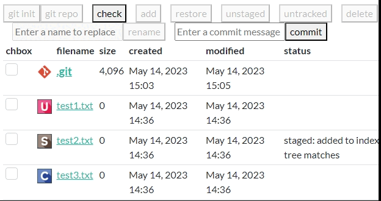
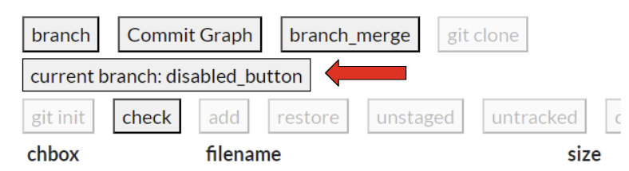
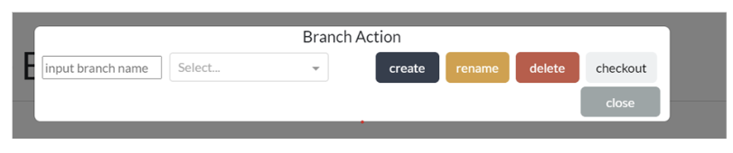
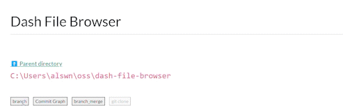
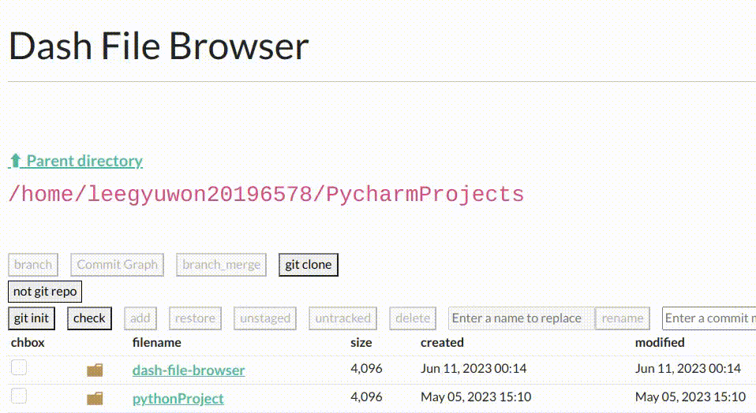
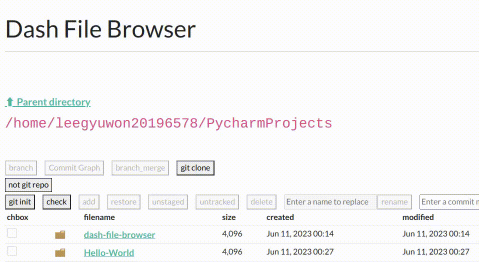

# Dash File Browser with Git repository management service
### A simple file browser for Plotly Dash applications.
- Allow users to interactively browse files and folders on the server
- Show folder icons for differentiation
- Expose files and folder as objects to be manipulated by your Dash app

### What is Dash File Browser with Git repository management service?
- A Dash File Browser with Git repository management service is a Python Dash-based repository browser. This browser provides a GUI-based browsing functionality for files and directories, as well as actions related to Git.
- If the current repository is not a Git repository, it offers GUI repository browsing functionality and the ability to convert it into a Git repository.
- If the current repository is a Git repository, it provides version control features, branch management functionality, the ability to view commit history, and the option to clone Git repositories.
### Why should we use Dash File Browser with Git repository management service?
- Compared to the command-line interface (CLI), using a GUI-based interface allows beginners to easily interact with Git-related functions through buttons, providing a more user-friendly environment.
- When checking commit logs, the GUI-based commit history allows for easier navigation and detailed information compared to the string-based commit history provided by the CLI, making it more convenient to use.

## 1. To run: 
```bash
If python or pip is not installed, pip and python must be installed
sudo apt install python3
sudo apt install pip
(If this command is not running, run sudo apt update and reinstall)

pip install -r requirements.txt
python app.py
or
pip3 install -r requirements.txt
python3 app.py
```
## 2. Requirements:
- Programming language: Python and dash frameworks
- Platform to run: Web
- We recommend Python 3.6 or later that is compatible with the Git CLI to use Python wrappers.
- We recommend that you use the latest version of Git to maintain compatibility with Git CLI.
- Operating systems are available for Linux, and Windows, but work best when running on __Linux systems__.

## 3. What is installed
```bash
dash
dash_mantine_components
dash-bootstrap-components
pandas
```

## Open Source SW Project #1 (2023)

## Feature #1: File explorer (file browser)
### The service provides a GUI for browsing files and directories on your computer. 
- The file browsing starts from the root directory of the computer or the most recently visited directory.
- All files and directories included in the current directory are displayed with their icon, name, and extension.
- A user can browse a directory by double clicking its icon.

## Feature #2: Git repository creation
### The service supports to turn any local directory into a git repository.
1. if the status is [not git repo], click [git init] button.
You can create a subdirectory called .git in the Git repository and its directory.
2. If the status is [git repo], the [git init] button is disabled.

## Feature #3 : Version controlling
### The service supports the version controlling of a git repository.
1. [add] [restore] [unstaged] [untracked] [delete] [rename] button
- To execute the desired command, 
- 1) Check the corresponding file with checkbox.
- 2) Click the [check] button.
- 3) Possible command buttons are activated.

2. [commit] button
However, in the case of the [commit] button, you do not need to follow the above procedure.
- After typing the commit message, press the [commit] button to create a pop-up window with git status information. Then, you can select for commit execution.

## Important Notes
### If you want to enter the command you want, make sure to check the check box and use the [check] button.
### After pressing the check button, you have to command only with the active button!



## Open Source SW Project #2 (2023)

## Feature #1: Branch management
### The service supports basic functionalities related with branches
- It always shows the current branch name on the browser (if the current directory is managed by git).
- 
- It provides a menu to create, delete, rename, and checkout branches and performs the following actions when a user selects it.
- 
- 

* Create: It asks the user to enter a branch name and then creates a branch with the name 
    * it executes 'git branch [branchname]'
* Delete: Asks the user to select one of them, and deletes the selected one.
    * it executes 'git branch -d [branchname]'
* Rename: Asks the user to select one of them and to enter a new name, and renames the branch
    * it executes 'git branch -m [old branchname] [new branchname]'
* Checkout: Asks the user to select one of them, and checkout the branch.
    * it executes 'git checkout [branchname]'
* If it is not possible to perform the requested action, then report an error message to the user. 

## Feature #2: Branch merge (not rebase)
### The service supports to merge two branches
- It provides a menu to merge a target branch to the current branch
- 
- 

* It first asks a user to select one of the branches (except the current branch)
* It then attempts to merge the selected branches
    * It executes 'git merge [branchname]'
* If success, It provides the user with a success message
* Otherwise, It provides the user with an error message
    * If the merge is failed due to conflict, it provides the user with unmerged paths and simply aborts the merge process

## Feature #3: Git commit history
### The service shows the commit history of a project in the form of a simplified graph.
- The history basically includes the workflow of the current branch.
- Each commit object in the graph includes its author name and message
- If a user chooses a commit object, then it provides the detailed information about the commit
- 

## Feature #4: Git clone from Github
### The service provides a functionality to clone a git repository from Github to local.
- When cloning public repositories, just paste https URL to Github repository address input box.
- When cloning private repositories, you need to enter the GitHub repository address, ID, and access token in the input box.
- 
- 